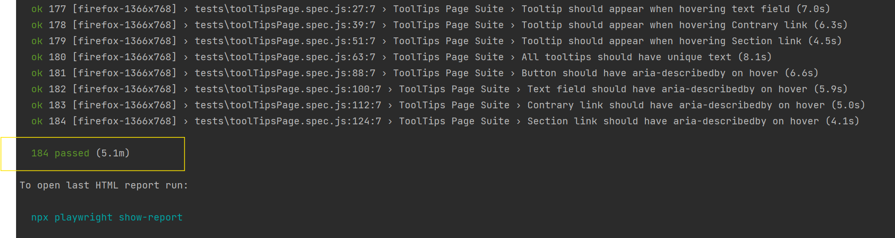

# UI Testing

## Installation

### 1. Clone the repository
```bash
git clone <repository-url>
cd <project-folder>
```

### 2. Install dependencies
```bash
npm install
```

### 3. Install Playwright browsers
```bash
npx playwright install
```

---

## Running Tests

### Note: Make sure you don't use VPN before running tests

### Run all tests
```bash
npm test
```

### Cross-Browser Testing
```bash
# Run only in Chrome
npm run test:chrome

# Run only in Firefox
npm run test:firefox

# Run in all browsers and resolutions (default)
npm test
```

### Screen Resolutions
```bash
# Run with specific resolution
npx playwright test --project=chromium-1920x1080
npx playwright test --project=chromium-1366x768
npx playwright test --project=firefox-1920x1080
npx playwright test --project=firefox-1366x768
```

### Parallel Execution
```bash
# Default: 4 workers
npx playwright test --workers=4

# Sequential execution
npx playwright test --workers=1

# Custom: 2 workers
npx playwright test --workers=2
```

### Run Tests by Keyword (--grep)
```bash
# Run tests containing "Test 1"
npx playwright test --grep "Test 1"

# Run all Positive tests
npx playwright test --grep "Positive"
```

### Run Specific Test File
```bash
# Practice Form tests only
npx playwright test tests/practiceFormPage.spec.js

# Alerts tests only
npx playwright test tests/alertsPage.spec.js

# With specific browser
npx playwright test tests/practiceFormPage.spec.js --project=chromium-1920x1080
```

Here are my results after running tests below:


### View Reports
```bash
npx playwright show-report
```

---

## CI/CD

Automated test runs:

- **Daily**: Every day at 9:00 AM UTC
- **Pull Request**: On PR creation or update to `main` or `task-2`
- **Push**: On push to the `main` branch

### CI Configuration
- **Browsers**: Chromium, Firefox
- **Resolutions**: 1920x1080, 1366x768
- **Workers**: 2 (configurable)
- **Retries**: 2 attempts on failure
- **Artifacts**: HTML reports, screenshots, JSON (retained for 30 days)

---

## Reports

### Local
```bash
npx playwright show-report
```

### In CI/CD
Reports are available in GitHub Actions:

1. Go to the **Actions** tab → select the workflow run
2. Download artifacts:
   - `playwright-report` — HTML report
   - `test-results` — JSON/JUnit results
   - `failed-test-screenshots` — error screenshots
```
